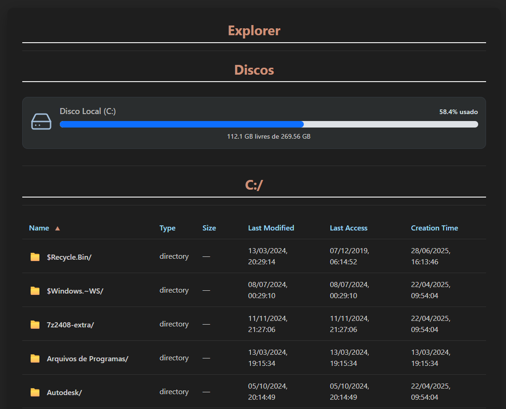

# Dashboard

Desenvolvido pelos alunos Jean Carlos do Nascimento Cunha e Murilo Motalvão Pereira para a disciplina de Sistemas Operacionais (CSO30), da UTPFR Curitiba, sob orientação do professor Marco Aurélio Wehrmeister.

- Software de dashboard semelhante a um gerenciador de tarefas.
- Desenvolvido em C++ utilizando a biblioteca **crow** para o back-end e vue-js para o front-end.
- Utiliza diretamente a API do Windows para obter informações do sistema.

---

## Descrição das Telas da Aplicação

### Informações Gerais do Sistema

- **Uso de Memória**
  - Utiliza `GlobalMemoryStatusEx`.
---

- **Uso da CPU**
  - Utiliza `NtQuerySystemInformation` com o parâmetro `SystemProcessorPerformanceInformation`.

---

- **Nome do Processo**
  - Utiliza `CreateToolhelp32Snapshot` + `Process32First`.
- **PID**
  - Utiliza `CreateToolhelp32Snapshot` + `Process32First`.
- **ID do Processo Pai**
  - Utiliza `CreateToolhelp32Snapshot` + `Process32First`.
- **Usuário**
  - Utiliza `OpenProcessToken` + `GetTokenInformation` + `LookupAccountSidW`.
- **Memory Working Set**
  - Utiliza `VirtualQueryEX`.
- **Memory Committed**
  - Utiliza `VirtualQueryEX`.
- **Private Memory Committed**
  - Utiliza `VirtualQueryEX`.
- **Memory Reserved**
  - Utiliza `VirtualQueryEX`.
- **Número de Páginas**
  - Utiliza `VirtualQueryEX`.
- **Prioridade Base (Processo)**
  - Utiliza `CreateToolhelp32Snapshot` + `Process32First`.
- **Classe de Prioridade**
  - Utiliza `GetPriorityClass`.
- **Número de Threads**
  - Utiliza `CreateToolhelp32Snapshot` + `Process32First`.
- **Prioridade Base (Thread)**
  - Utiliza `CreateToolhelp32Snapshot` + `Thread32First`.
- **Classe de Prioridade (Thread)**
  - Utiliza `CreateToolhelp32Snapshot` + `Thread32First`.
- **Handles (Recursos Abertos)**
  - Coleta diversos tipos de handles abertos pelo processo, incluindo:
    - **Semáforos**: Mecanismos de sincronização.
    - **Mutexes**: Mecanismos para controle de acesso exclusivo a recursos.
    - **Arquivos em Disco**: Referências a arquivos e diretórios no sistema de arquivos.
    - **Arquivos de Caractere**: Dispositivos como portas seriais ou consoles.
    - **Pipes**: Canais de comunicação interprocessos.
    - **Arquivos Desconhecidos**: Handles de arquivo que não se enquadram nas categorias anteriores.
    - **Diretórios**: Handles para diretórios do sistema de arquivos.
    - **Dispositivos**: Handles para dispositivos de hardware.
  - A obtenção dessas informações utiliza `NtQuerySystemInformation` (para listar handles do sistema) e `DuplicateHandle` (para duplicar e inspecionar handles específicos do processo), juntamente com `GetFileType` para categorização de arquivos.

---
  ## Informações do Explorador de Arquivos

- **Volumes do Sistema (Discos)**
  - Lista todos os volumes disponíveis (discos, partições).
  - Para cada volume, coleta:
    - **GUID do Volume**: Identificador único do volume.
    - **Caminhos de Acesso**: Letras de unidade e pontos de montagem associados.
    - **Nome do Volume**: Nome atribuído ao volume (ex: "Sistema Operacional", "Dados").
    - **Número de Série**: Identificador único do volume.
    - **Tamanho Máximo do Componente**: O comprimento máximo permitido para um nome de componente de arquivo em um caminho no sistema de arquivos.
    - **Flags do Sistema de Arquivos**: Propriedades do sistema de arquivos (ex: suporte a compressão, case-sensitive).
    - **Nome do Sistema de Arquivos**: O tipo do sistema de arquivos (ex: NTFS, FAT32).
    - **Espaço Total, Usado e Livre**: Detalhes sobre a ocupação de espaço no volume.
  - As informações são obtidas usando `FindFirstVolumeW`, `FindNextVolumeW`, `GetVolumePathNamesForVolumeNameW`, `GetVolumeInformationW`, e `GetDiskFreeSpaceExW`.

- **Conteúdo de Diretórios**
  - Permite listar arquivos e subdiretórios dentro de um caminho especificado.
  - Para cada item, exibe:
    - **Nome do Arquivo/Diretório**: O nome do item.
    - **Tamanho do Arquivo**: Para arquivos, o tamanho em bytes.
    - **Horário de Criação**: Quando o arquivo/diretório foi criado.
    - **Último Acesso**: Quando o arquivo/diretório foi acessado pela última vez.
    - **Última Gravação**: Quando o arquivo/diretório foi modificado pela última vez.
  - A funcionalidade é implementada com `FindFirstFileW` e `FindNextFileW`, e conversão de `FILETIME` para `std::chrono::system_clock::time_point`.

---